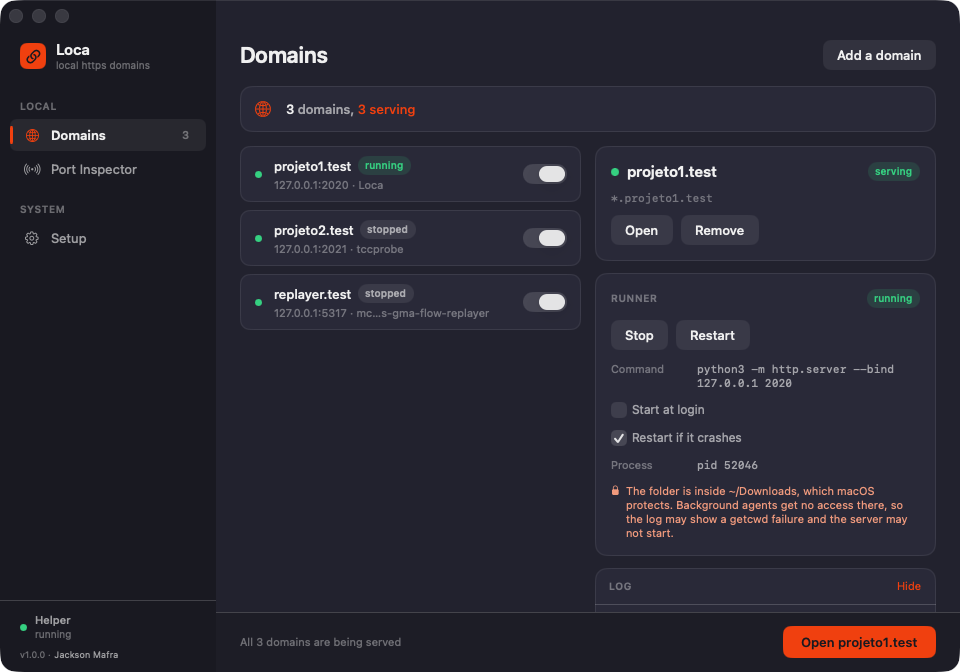
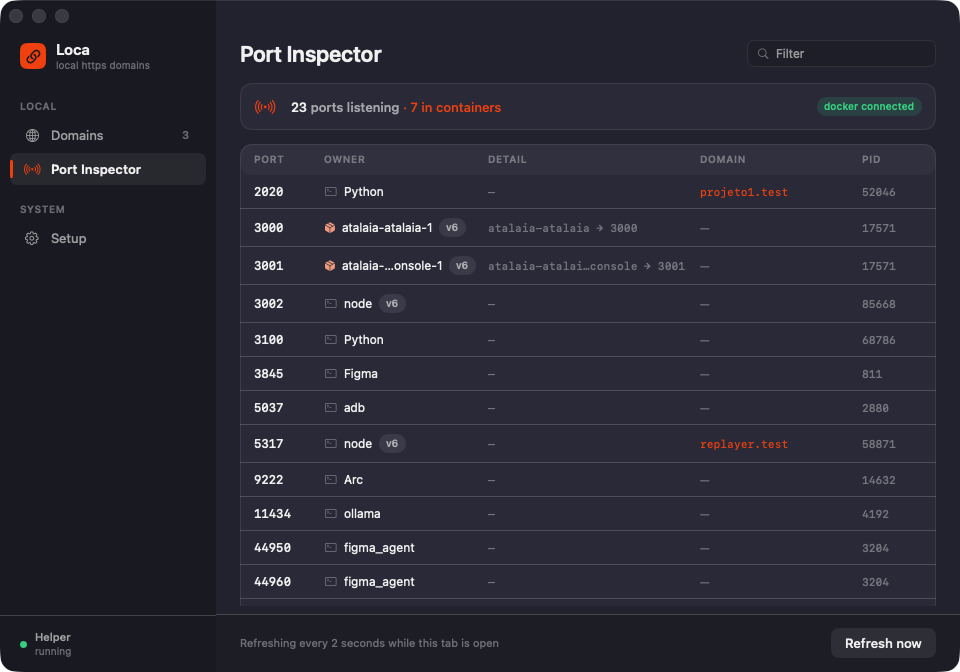

<h1>Loca</h1>

Local HTTPS domains for macOS. Drop a project folder in, and it gets
`https://projeto1.test` — trusted certificate, wildcard subdomains, proxied to
whatever port it runs on.

It also starts and stops your dev servers, and shows which process is holding
which port.



```
https://projeto1.test        →  127.0.0.1:2020
https://api.projeto1.test    →  127.0.0.1:2020   same certificate, nothing to configure
https://projeto2.test        →  127.0.0.1:2021
```

## Install

```sh
make vendor-caddy     # pinned Caddy, verified by checksum
make app              # assembles and signs build/Loca.app
make install          # copies it to /Applications and launches it
```

Needs macOS 14, Xcode 26, and any Apple Development signing certificate. Then
three one-time steps in the Setup pane: install the helper, point `.test` at
Loca, trust the certificate authority.

Loca is not notarized — the source is public and you build it yourself.
Full steps, including the Firefox caveat, in
**[Installing](https://github.com/jacksonmafra-umain/loca/wiki/Installing)**.

## How it works

- **`.test`** is reserved by RFC 6761 and can never resolve publicly, so
  nothing you register can collide with a real domain.
- **A resolver entry** sends every `.test` lookup to a DNS responder on
  `127.0.0.1:53531` that answers with loopback — which is why subdomains work
  at any depth without being registered.
- **A bundled Caddy** holds 80 and 443 and proxies each domain to its port,
  issuing certificates from a local authority. Enabling a domain is a config
  load, not a restart, so open connections survive.
- **One `launchd` agent per project** runs your dev server in your login
  session, which is what gives it your `PATH`, your nvm, and your Keychain.

Only one component runs as root: a helper that binds the two privileged ports
and owns the resolver file. The GUI, the port inspector, and your servers all
run as you.

## The port inspector



Every listening TCP port with the process that owns it, and Docker-published
ports resolved to their container name — under `lsof` they all read
`com.docker.backend` against one shared pid, which answers nothing.

## Documentation

| Page | |
| --- | --- |
| [Installing](https://github.com/jacksonmafra-umain/loca/wiki/Installing) | Requirements, building, signing, first run |
| [Adding domains](https://github.com/jacksonmafra-umain/loca/wiki/Adding-domains) | What the detector reads, and what it does with it |
| [Troubleshooting](https://github.com/jacksonmafra-umain/loca/wiki/Troubleshooting) | Every failure mode, with the symptom you would see |
| [Command line](https://github.com/jacksonmafra-umain/loca/wiki/Command-line) | Every flag on the app binary |
| [Architecture](https://github.com/jacksonmafra-umain/loca/wiki/Architecture) | How it is built, and why |
| [Uninstalling](https://github.com/jacksonmafra-umain/loca/wiki/Uninstalling) | What is removed, and what is deliberately kept |

## Development

```sh
make test    # 195 tests, no root and no Caddy needed
make app     # build and sign
make run     # build, sign, and launch from build/
make help    # every target
```

Three targets: `LocaCore` is a pure library holding everything worth testing and
imports nothing but Foundation; `LocaHelper` is the root daemon; `LocaApp` is the
unsandboxed SwiftUI app. There is no Xcode project — the bundle is assembled by
the `Makefile`, so every step is readable in a diff.

## Credits

Built by **[Jackson Mafra](https://github.com/jacksonmafra-umain)**.

Bundles [Caddy](https://caddyserver.com) for TLS and proxying, under its
Apache 2.0 licence — see [NOTICE](NOTICE).

Licensed under the [MIT licence](LICENSE). Copyright © 2026 Jackson Mafra.
